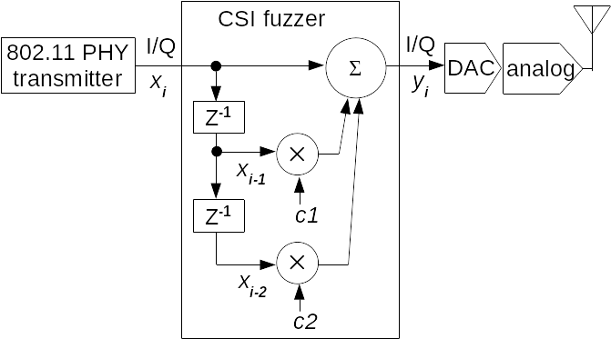
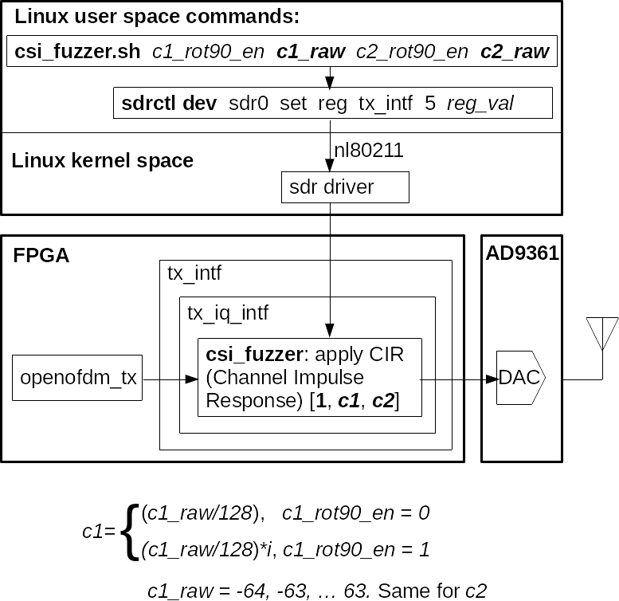
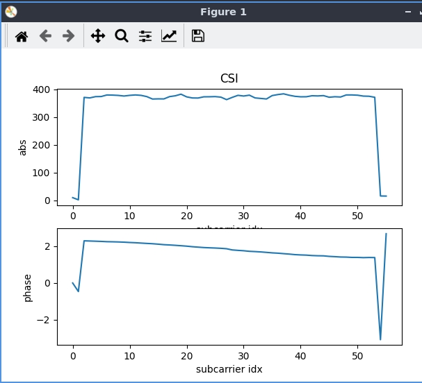

<!--
Author: Xianjun jiao
SPDX-FileCopyrightText: 2021 UGent
SPDX-License-Identifier: AGPL-3.0-or-later
-->

[ACM WiSec 2021. Openwifi CSI fuzzer for authorized sensing and covert channels](https://dl.acm.org/doi/pdf/10.1145/3448300.3468255)

CSI (Channel State Information) of WiFi systems is available in some WiFi chips and can be used for sensing the environment (keystrokes, people, object) passively and secretly.

## Concept

How could a CSI fuzzer stop unauthorized sensing?


CSI fuzzer implementation principle.



## Demo instructions

Thanks to the full-duplex capability and CSI extraction feature of openwifi, you can monitor the artificial channel response via [side channel](./csi.md) by Tx-Rx over the air coupling without affecting the normal operation/traffic of openwifi. Before fuzzing the CSI, please follow [WiFi CSI radar via self CSI capturing](radar-self-csi.md) app note to setup normal self CSI monitoring.

Then, start another ssh session to the openwifi board:
```
ssh root@192.168.10.122
(password: openwifi)

cd openwifi

./csi_fuzzer_scan.sh 1
(CSI fuzzer applies possible artificial CSI by scanning all values)
(csi_fuzzer.sh is called. Please read both scripts to understand these commands)
```

Now you should see that CSI keeps changing like in this [video](https://youtu.be/aOPYwT77Qdw).

# Further explanation on parameters

CSI fuzzer in openwifi system architecture and related commands.



# Example fuzzed CSI

CSI self-monitoring before fuzzing.



CSI self-monitoring after  fuzzing command: `./csi_fuzzer.sh 1 45 0 13`


`csi_fuzzer_scan.sh` can scan the c1 and c2 in different styles/modes by calling `csi_fuzzer.sh`.
