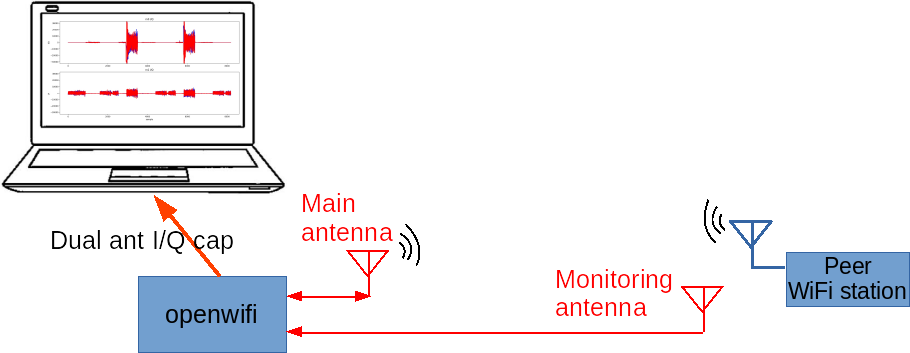
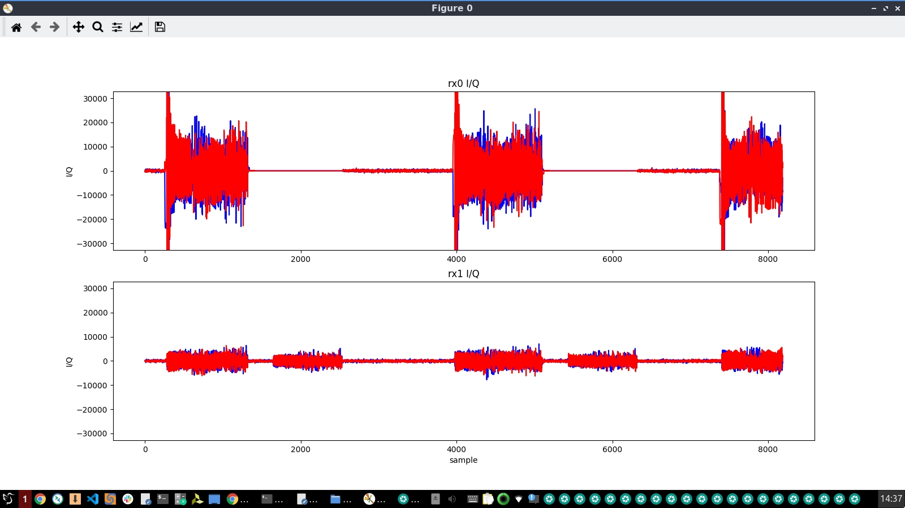

<!--
SPDX-FileCopyrightText: 2019 Jiao Xianjun <putaoshu@msn.com>
SPDX-License-Identifier: AGPL-3.0-or-later
-->


Instead of [**normal IQ sample capture**](iq.md), this app note introduces how to enable the I/Q capture for dual antennas. Besides the I/Q from the main antenna (that is selected by baseband), the I/Q samples from the other antenna (monitoring antenna) is captured as well (coherently synchronized) in this dual antenna mode. You are suggested to read the [**normal IQ sample capture**](iq.md) to understand how we use the side channel to capture I/Q samples by different trigger conditions.

In this app note, we show how to use the dual antenna I/Q capture to capture the collision.


## Quick start
  The main antenna rx0 (by default selected by baseband if you do not select explicitly by set_ant.sh) is always used for communication and I/Q capture. Meanwhile, the other antenna (rx1 -- monitoring antenna) will be also available for capturing rx I/Q if you are using AD9361 based RF board, such as fmcomms2/3 and adrv9361z7035, by turning on the **dual antenna capture** mode. In this case, you can place the other antenna (rx1) close to the communication peer (for example, the other WiFi node) to capture the potential collision by monitoring rx1 I/Q. The nature of collision is that both sides of a communication link are trying to do transmission at the same time.
  
  The collision capture steps:
  - Change rx1 AGC to manual mode instead of fast_attack in rf_init.sh by:
  ```
  echo manual > in_voltage1_gain_control_mode
  ```
  - Change rx1 gain to a low level, such as 20, by:
  ```
  echo 20 > in_voltage1_hardwaregain
  ```
  - Use the new rf_init.sh script to boot up the SDR board, and setup the working scenario.
  - Setup the side channel:
  ```
  insmod side_ch.ko iq_len_init=8187
  (iq_len_init should be <4096, like 4095, if smaller FPGA, like z7020, is used)
  ./side_ch_ctl wh11d2000
  (Set a smaller pre_trigger_len 2000, because we want to see what happens after the trigger instead of long period stored before the trigger)
  ```
  - Put the other antenna (rx1) close to the peer WiFi node, set trigger condition to 23 (baseband tx done)
  ```
  ./side_ch_ctl wh8d23
  ```
  - Enable the **dual antenna capture** mode
  ```
  ./side_ch_ctl wh3h11
  ```
  - Run some traffic between the SDR board and the peer WiFi node, and start the user space I/Q capture program
  ```
  ./side_ch_ctl g
  ```
  If the printed "**side info count**" is increasing, it means the trigger condition is met from time to time.
  - On remote computer, run
  ```
  python3 iq_capture_2ant.py
  (if smaller FPGA, like z7020, is used, add a argument that equals to iq_len_init, like 4095)
  ```
  Above script will plot the real-time rx0 and rx1 I/Q captured each time the trigger condition is met. . 
  
  In the above example, the upper half shows the signal received from the main antenna (self tx is not seen because of self muting in FPGA), the lower half shows not only the rx signal from the monitoring antenna but also the tx signal from the main antenna due to coupling.
  Meanwhile the script also prints the maximum amplitude of the rx0 and rx1 I/Q samples. Check the 3rd column that is displayed by the script: Those small value printing indicate noise (most probably, because the rx1 gain is very low). The big value printing indicates a packet from rx1 (although rx1 has very low gain, rx1 is very close to the peer WiFi node). Go through the noise and the packet max I/Q amplitude numbers from rx1 printing (the 3rd column), and decide a threshold value that is significantly higher than the noise but less than those big values (packets).
  - Set trigger condition to 29, which means that rx1 I/Q is found larger than a threshold while SDR is transmitting -- this means a collision condition is captured because rx1 I/Q implies the transmitting from the peer WiFi node. The threshold value is decided in the previous step (2500 is assumed here).
  ```
  (Quit side_ch_ctl by Ctrl+C)
  ./side_ch_ctl wh8d29
  ./side_ch_ctl wh9d2500
  ./side_ch_ctl g
  ```
  - Now the trigger condition can capture the case where both sides happen to transmit in an overlapped duration. If the  printed "**side info count**" is increasing, it means the collision happens from time to time.
  - You can also see it via iq_capture_2ant.py or do offline analysis by test_iq_2ant_file_display.m 
  - Check the **iq1** signal in FPGA ILA/probe (triggered by signal "iq_trigger") for further debug if you want to know what exactly happened when collision is captured.
